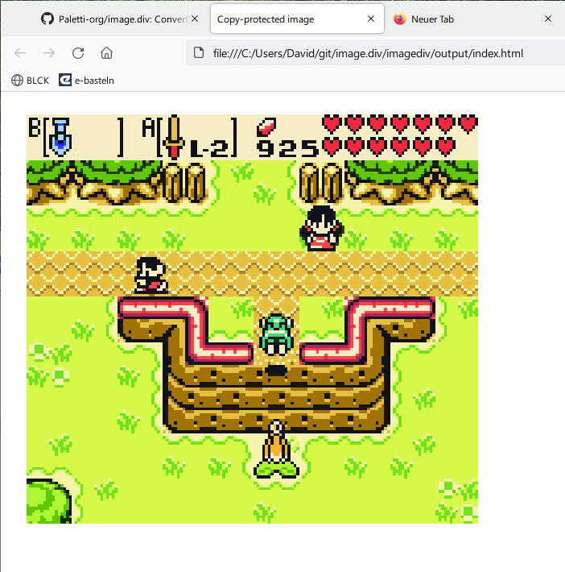

Copy-Protect your web images
============================

Have you ever wondered how to make your web images truly copy-protected? If so, 
this is the solution! Images made from html-div-pixels. Rendered by the browser.
Of course, an image pirate could still take screenshots which *seems* like 
an easy workaround, but this requires additional skills an is not in scope
for this project.

Screenshot 1: An image made from 7,985 html divs.

Naturally, this is very inefficient. The example file (``example.png``) comes in original 
gameboy color resolution, 160x144, and has a size of 23kb. The output 
html and css blow that up to 362kb! And this is after two optimizations: After 
noticing huge css files in the first version, I changed it so that repeated colors
use the same css id (which is basically palette indexing). Secondly, when horizontally
neighbouring pixels are equal, I changed it to stretch the div instead of using
single divs with the same color value. That's the reason the example has only
7,985 divs instead of (160x144 = )  23,040.
Still, this does not work well with bigger images. ``example2.png`` has a 
geometry of 512x512 pixels and already takes a good while for my Firefox to render.
I tried converting a wallpaper (1920x1080), but upon seeing the .html file size 
of 650Mb I didn't even try to open it. 

Pro's:
 - can't copy

Con's:
 - can screenshot
 - huge files
 - slow render

If you want to try it out, just clone and edit the source for the correct file.
This is not packaged nor does it have a cli, after all, who would want to use
this?